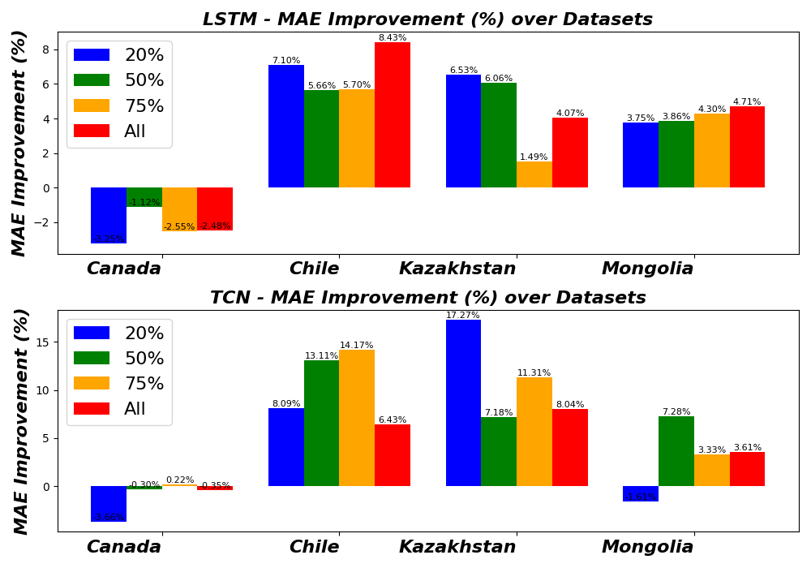
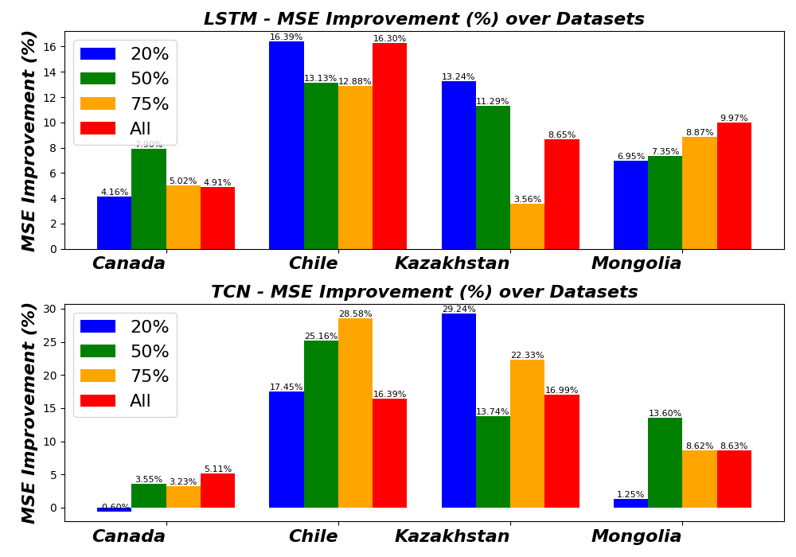
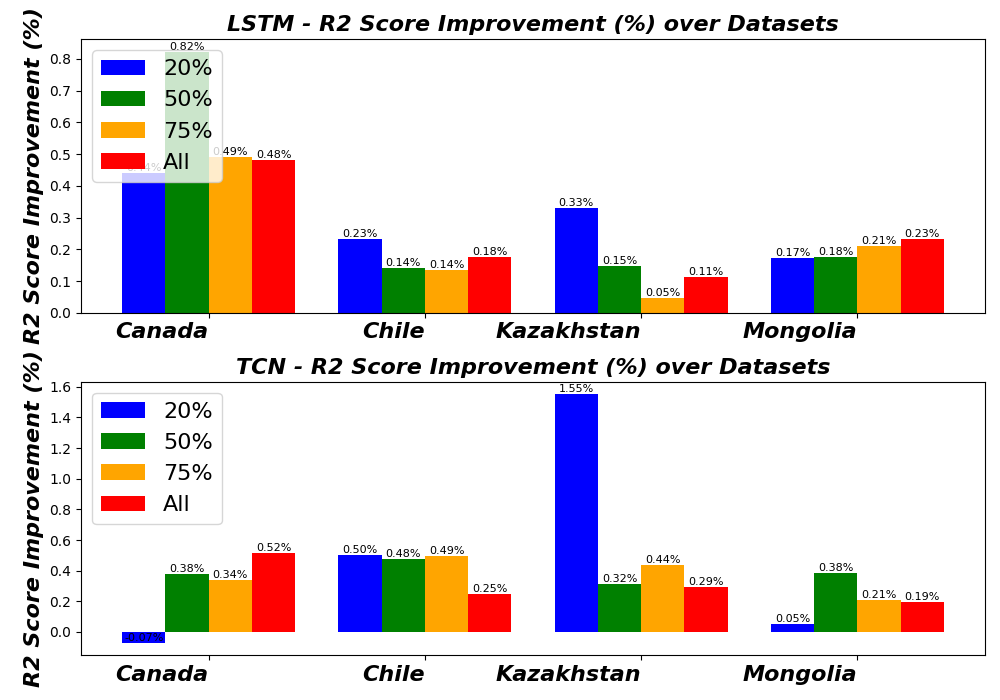

# Time Series Forecasting with LSTM and TCN Models
This project implements a machine learning framework for time series forecasting using Long Short-Term Memory (LSTM) networks and Temporal Convolutional Networks (TCN). The aim is to enhance predictive accuracy through Integrating Physics Informed Vectors as an input and part of loss function. The block diagram of the proposed work is given below 
### Block Diagram


## Table of Contents
- [Installation](#installation)
- [Project Structure](#project-structure)
- [Running the Project](#running-the-project)
- [Loss Functions](#loss-functions)
- [Results](#results)
- [Publication](#Publication)
- [License](#license)

## Installation
1. Clone the repository:
   ```bash
   git clone <repository-url>
   cd <repository-name>
### Set up a virtual environment

python -m venv venv
source venv/bin/activate  # On Windows use `venv\Scripts\activate`

pip install -r requirements.txt
## Project Structure

.
├── 20_Percent
│   ├── canada_data
│   │   ├── ...
│   ├── chilli_data
│   │   ├── ...
│   ├── kazakistan
│   │   ├── ...
│   └── Mongolia
│       ├── ...
├── 50_Percent
│   ├── canada_data
│   │   ├── ...
│   ├── chilli_data
│   │   ├── ...
│   ├── kazakistan
│   │   ├── ...
│   └── Mongolia
│       ├── ...
├── 75_Percent
│   ├── canada_data
│   │   ├── ...
│   ├── chilli_data
│   │   ├── ...
│   ├── kazakistan
│   │   ├── ...
│   └── Mongolia
│       ├── ...
└── All
│   ├── canada_data
│   │   ├── ...
│   ├── chilli_data
│   │   ├── ...
│   ├── kazakistan
│   │   ├── ...
│   └── Mongolia
│       ├── ...

## Running the Project
1. Navigate to the Desired Dataset Folder: Change directory to the specific dataset folder (e.g., 20_Percent, 50_Percent, or 75_Percent).
2. Modify Shell Script Parameters (if necessary): Open the corresponding .sh file (e.g., run.sh) and adjust parameters such as NUM_EPOCHS, BATCH_SIZE, and INITIAL_LR as needed.
3. Execute the Shell Script: Run the script in your terminal:
bash run.sh
## Loss Function 
## Loss Function
The loss function used in this model is defined as follows:

\[ 
L = \frac{1}{N} \sum_{i=1}^{N} (S_{t+1,i} - \hat{\hat{S}}_{t+1,i})^2 + \lambda_0 e^{-pt} \frac{1}{N} \sum_{i=1}^{N} (\hat{\hat{S}}_{t+1,i} - \hat{S}_{t+1,i})^2 
\]

Where:
- \( L \) is the total loss.
- \( N \) is the number of samples.
- \( S_{t+1,i} \) is the true value.
- \( \hat{\hat{S}}_{t+1,i} \) is the predicted value from the current model.
- \( \lambda_0 \) and \( p \) are hyperparameters controlling the regularization term you can adjust from run.sh.

## Results
The proposed integration on different datasets and their subsets has achieved the following performance:


### Performance Metrics

#### Mean Absolute Error (MAE)


#### Mean Squared Error (MSE)


#### R-Squared (R2)


The generated plots illustrate improvements in model performance over iterations. Review these files to understand how the model's accuracy evolves with different configurations.

## Publication
This work has been published in the following conference:

**Title:** Integrating Physics-Informed Vectors for Improved Wind Speed Forecasting with Neural Networks  
**Authors:** Laeeq Aslam, Runmin Zou, Ebrahim Awan, Sharjeel Abid Butt  
**Conference:** 2024 14th Asian Control Conference (ASCC)  
**Pages:** 1902-1907  
**Year:** 2024  
**Organization:** IEEE  

You can check out the paper [here](https://doi.org/10.1109/ASCC52936.2024.00190). 

If you use this code or any part of it in your research, please cite us as follows:

@inproceedings{aslam2024integrating,
  title={Integrating Physics-Informed Vectors for Improved Wind Speed Forecasting with Neural Networks},
  author={Aslam, Laeeq and Zou, Runmin and Awan, Ebrahim and Butt, Sharjeel Abid},
  booktitle={2024 14th Asian Control Conference (ASCC)},
  pages={1902--1907},
  year={2024},
  organization={IEEE}
} 


